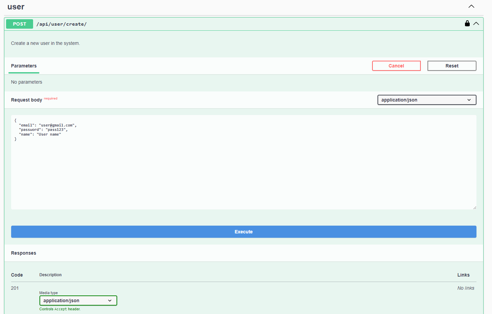
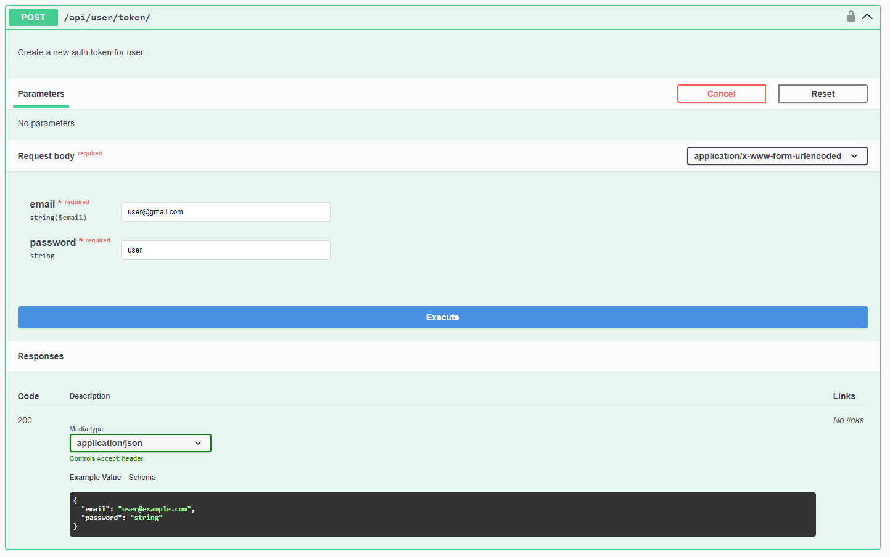
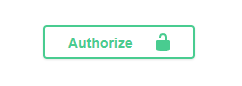
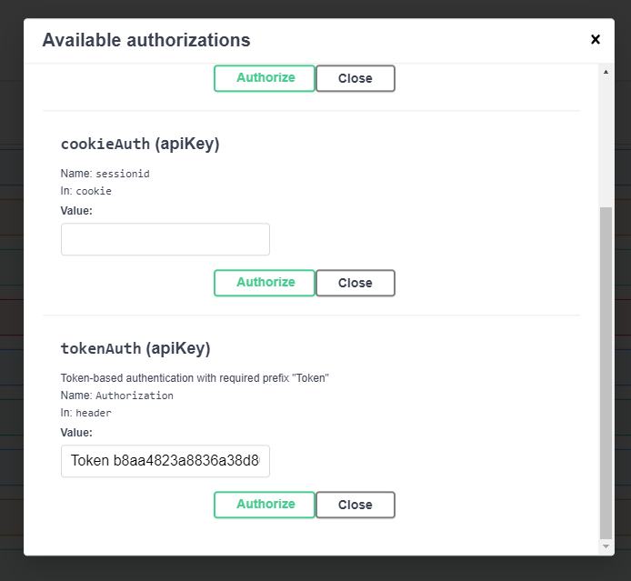
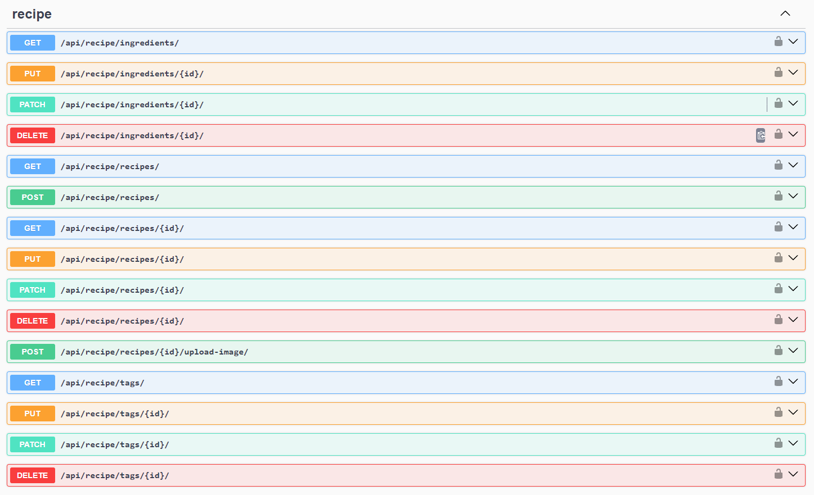

# About

Make a recipe and add ingredients, image, and tags.

Filter recipes by tags and ingredients.

Automated testing of API endpoints.

<br>

# Prerequisites

Install [Docker](https://docs.docker.com/get-docker/) and [Docker Compose]().

<br>

# Usage

### Clone

```bash
git clone https://github.com/Tantan1939/recipe-app-api.git
```

### Build

```bash
docker-compose build
```

### Migrate

```bash
docker-compose run --rm app sh -c "python manage.py migrate"
```

### Run

```bash
docker-compose up
```

<br>

# Test

### Run the unit tests

```bash
docker-compose run --rm app sh -c "python manage.py test"
```

<br>

# API Documentations

Open this [Link](http://localhost:8000/api/docs/) in your browser.

<br>

## Create user



<br>

## Login







<br>

## Recipe APIs


